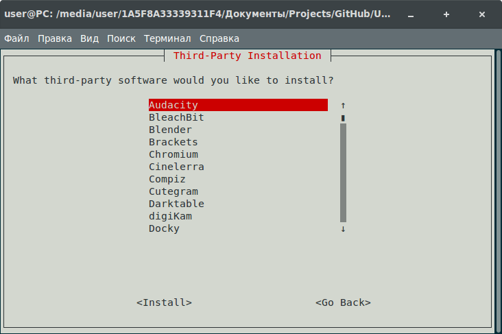
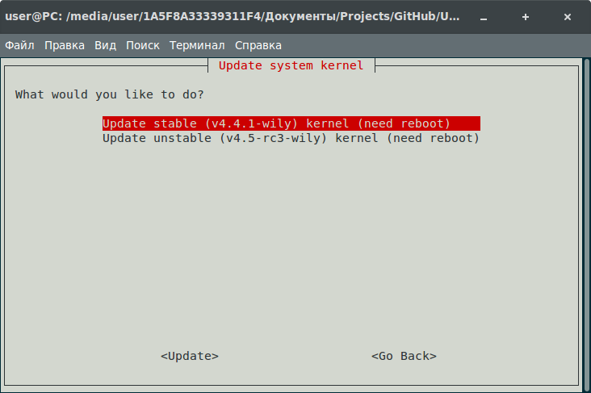
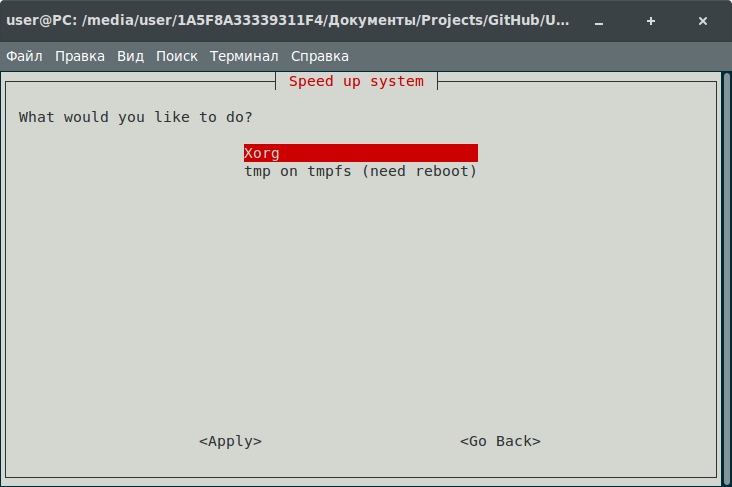

# Ubuntu Post Install Script
===========================

Original Author: [Sam Hewitt](https://github.com/snwh)

> This project is my set of post-installation and maintenance scripts for Ubuntu, to run on a fresh install. It's designed to install your favourite applications, set your preferred settings, etc. mostly automatically.

This project provides a set of shell scripts to be run after a fresh install of an Ubuntu(-based) OS. It will install your favourite applications, set your preferred settings, etc.

## Thanks
Thanks to [Sam Hewitt] (https://github.com/snwh) for the script [based](https://github.com/snwh/ubuntu-post-install).

##Structure

## Usage
Run in the console for install tool Git:

Optionally, you can add a third-party repository `sudo add-apt-repository ppa:git-core/ppa` to install a newer version

    sudo apt update
    sudo apt install git

Run in the console:

    git clone https://github.com/igor-dyatlov/ubuntu-post-install-script.git

Alternatively you can [download](https://github.com/igor-dyatlov/ubuntu-post-install-script/archive/master.zip) this repository.

Run from source folder:

    ./start.sh

## Structure

This project is coded and organized in a modular fashion so you can easily delete or exclude parts that you don't want to use.

* [`data`](/data): this folder contains files which are lists of packages read by various functions. It's recommended to update theto suit your preferences.
* [`functions`](/functions): this folder contains bash files which are the main functions of this scriptset. They should requilittle modification.
* [`third-party`](/functions/third-party): this sub-directory contains further bash files that are functions for the installation third-party applications &ndash;i.e. those that aren't necessarily in the main repositories.

## Note
The included [preferences](functions/configure) and [lists of packages](data) are those of the original author, you will have to change them to suit yourself.

### Features
 - Update system [update](functions/update)
 - Cleaning system [cleanup](functions/cleanup)
 - Configure system [configure](functions/configure)
 - Upgrading the kernel [kernel](functions/kernel)
 - Install the program in two steps [lists of packages](data)
 - Speed Up system [speedup](functions/speedup)

## Screenshots

### Donation
https://www.paypal.me/IgorDyatlov

### License
All files in this project are under the [LICENSE.md](LICENSE.md) license unless otherwise stated in the file or by a dependency's license file.
